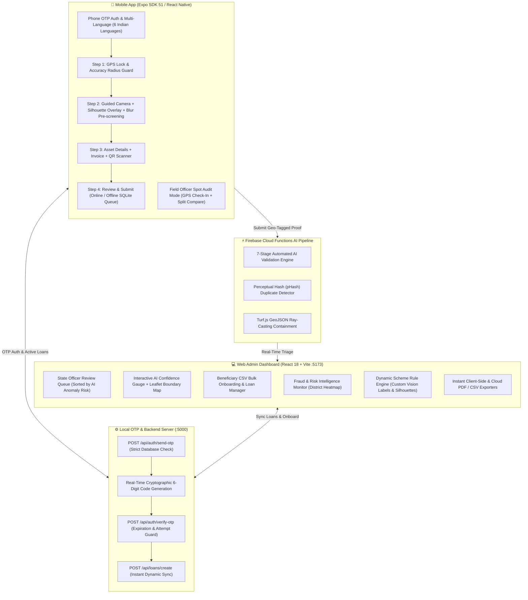

# 🏦 LoanVerify — Field Utilization & Loan Tracking System

> **Government & Bank Loan Disbursement Field Verification Platform**  
> Mobile-first proof submission with guided silhouette camera, 7-stage AI anomaly validation, district boundary containment across 12 Indian districts, 9 national schemes, real-time fraud monitoring, and automated offline-first synchronization.

---

## 🏗️ System Architecture



---

## 🏛️ Supported Schemes (9 National Directives)

| # | Scheme Name | Asset Category | Silhouette | Target Labels | Sanction Limit |
|---|---|---|---|---|---|
| 1 | **National Livestock Mission** | Milch Animal (Cow/Buffalo) | 🐄 `animal` | `cow, cattle, bovine, dairy, livestock` | ₹2,00,000 |
| 2 | **Sub-Mission on Agri Mechanization** | Tractor | 🚜 `tractor` | `tractor, vehicle, agricultural machinery` | ₹7,50,000 |
| 3 | **PMMY Mudra Micro Textile** | Sewing Machine | 🧵 `machine` | `sewing machine, apparel, textile, tailor` | ₹1,00,000 |
| 4 | **PM-KUSUM Solar Agriculture** | Solar Water Pump | ☀️ `solar` | `solar panel, solar energy, water pump, pipe` | ₹3,00,000 |
| 5 | **PMMSY Fishery & Aquaculture** | Fish Farming Unit | 🐟 `fish` | `fish, aquaculture, water tank, biofloc, pond` | ₹5,00,000 |
| 6 | **National Beekeeping Mission (NBHM)** | Beekeeping & Honey Unit | 🐝 `honey` | `beehive, honeycomb, apiary, bee box, honey` | ₹2,00,000 |
| 7 | **NABARD Rural Infrastructure** | Micro Cold Storage | 🏭 `warehouse` | `cold storage, warehouse, refrigeration, crates` | ₹10,00,000 |
| 8 | **PM e-Drive / FAME-II Green Mobility** | Electric Cargo Vehicle | 🛺 `vehicle` | `electric vehicle, rickshaw, three-wheeler, ev` | ₹3,50,000 |
| 9 | **PMKSY Per Drop More Crop** | Drip Irrigation System | 💧 `irrigation` | `drip irrigation, sprinkler, pipes, filter unit` | ₹1,80,000 |

---

## 📍 Supported Locations & Districts (12 Indian Districts)

| District | State | Geographic Zone | Coordinates (Center) |
|---|---|---|---|
| **Pune** | Maharashtra | West | `18.5204° N, 73.8567° E` |
| **Varanasi** | Uttar Pradesh | North | `25.3176° N, 82.9739° E` |
| **Jaipur** | Rajasthan | North-West | `26.9124° N, 75.7873° E` |
| **Coimbatore** | Tamil Nadu | South | `11.0168° N, 76.9558° E` |
| **Patna** | Bihar | East | `25.5941° N, 85.1376° E` |
| **Ludhiana** | Punjab | North | `30.9010° N, 75.8573° E` |
| **Ahmedabad** | Gujarat | West | `23.0225° N, 72.5714° E` |
| **Bengaluru Rural** | Karnataka | South | `13.2285° N, 77.5824° E` |
| **Kamrup (Guwahati)** | Assam | North-East | `26.1445° N, 91.7362° E` |
| **Indore** | Madhya Pradesh | Central | `22.7196° N, 75.8577° E` |
| **Ernakulam (Kochi)** | Kerala | South | `9.9816° N, 76.2999° E` |
| **Khordha (Bhubaneswar)** | Odisha | East | `20.2961° N, 85.8245° E` |

---

## 🚀 Quick Start & Installation

### Option A: One-Command Installation
```bash
./install-all.sh
```

### Option B: Manual Installation
```bash
cd server && npm install && cd ..
cd web-dashboard && npm install && cd ..
cd mobile && npm install && cd ..
cd functions && npm install && cd ..
```

---

### Start the Local Servers (Open in 3 Separate Terminals)

#### Terminal 1 — Start Local OTP & Authentication Server (Port 5000)
```bash
cd server
npm start
```

#### Terminal 2 — Start Web Admin Dashboard (Port 5173)
```bash
cd web-dashboard
npm run dev
```
*Browser URL:* **`http://localhost:5173`**

#### Terminal 3 — Start Mobile App (Browser Preview / Native)
```bash
cd mobile
npm run web
```
*Browser URL:* **`http://localhost:8081`**

---

## 👥 Pre-Registered Test Personas & Credentials

| Mobile Number | Beneficiary Name | District, State | Scheme / Asset Category | Sanctioned Amount |
|---|---|---|---|---|
| `9812345670` | Himesh Patil | Pune, Maharashtra | Dairy Cattle (Milch Animal) | ₹1,80,000 |
| `9812345671` | Sunita Sharma | Varanasi, Uttar Pradesh | Farm Mechanization (Tractor) | ₹5,50,000 |
| `9812345672` | Kavitha Raman | Coimbatore, Tamil Nadu | PMMY Mudra (Sewing Machine) | ₹75,000 |
| `9812345673` | Amit Verma | Jaipur, Rajasthan | PM-KUSUM (Solar Water Pump) | ₹2,20,000 |
| `9812345674` | Rajesh Paswan | Patna, Bihar | Dairy Cattle (Milch Animal) | ₹1,60,000 |
| `9812345675` | Meera Devi | Pune, Maharashtra | PMMY Mudra (Sewing Machine) | ₹85,000 |
| `9812345676` | Harpreet Singh | Ludhiana, Punjab | Farm Mechanization (Tractor) | ₹6,00,000 |
| `9812345677` | Bhavik Patel | Ahmedabad, Gujarat | Electric Cargo Vehicle (PM e-Drive) | ₹3,20,000 |
| `9812345678` | Manjunath Gowda | Bengaluru Rural, Karnataka | Drip Irrigation System (PMKSY) | ₹1,40,000 |
| `9812345679` | Dipankar Saikia | Kamrup, Assam | Fish Farming Unit (PMMSY) | ₹4,50,000 |
| `9812345680` | Raghuveer Yadav | Indore, Madhya Pradesh | Micro Cold Storage (NABARD) | ₹8,50,000 |
| `9812345681` | Thomas Kurian | Ernakulam, Kerala | Fish Farming Unit (PMMSY) | ₹4,80,000 |
| `9812345682` | Jayanti Behera | Khordha, Odisha | Beekeeping & Honey Unit (NBHM) | ₹1,80,000 |

### Officers Roster:
| Mobile Number | Officer Name | Role | Access Level |
|---|---|---|---|
| `9876543210` | Anjali Deshmukh | State Agency Officer | Review Console, Low-Risk Bulk Approvals, Risk Meter |
| `9876543211` | Suresh Kumar | Bank Lead Administrator | Single Loan Creation & CSV Bulk Onboarding |
| `9876543212` | Vikram Shinde | Field Verification Officer | GPS Arrival Check-in, On-Site Spot Audits |
| `9876543213` | Dr. Aruna Roy | Super Administrator | System-wide Fraud Heatmaps & Scheme Rule Engine |
